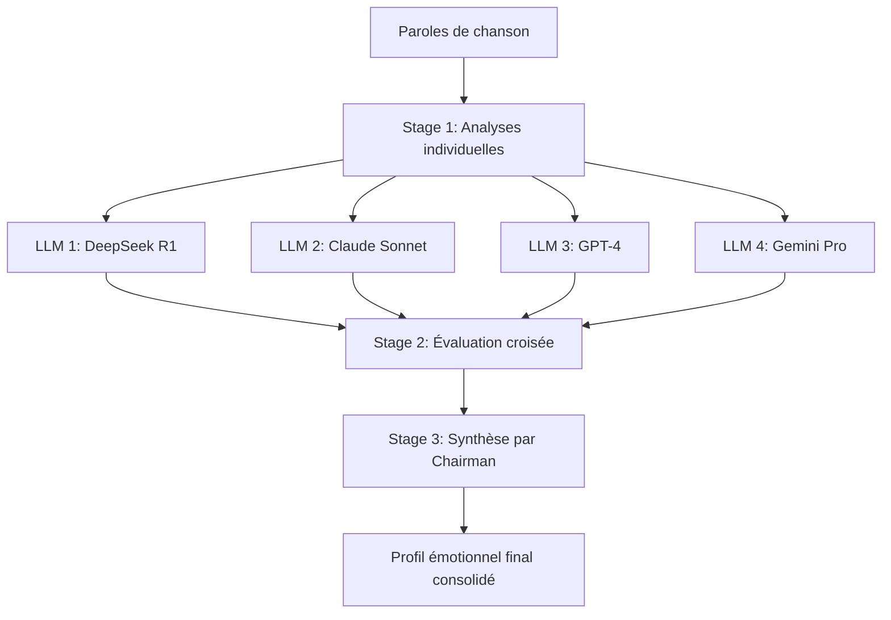

# Cahier des Charges - Consortium LLM

## 📋 Objectif

Transformer le système d'analyse actuel (mono-LLM avec DeepSeek R1) en un **consortium de LLMs** inspiré du projet [llm-council](https://github.com/karpathy/llm-council) d'Andrej Karpathy.

L'objectif est d'obtenir des analyses émotionnelles et sémantiques plus robustes et nuancées en combinant les perspectives de plusieurs modèles d'IA.

---

## 🔍 Analyse de l'existant

### Architecture actuelle

```
src/analysis.py
├── analyze_emotional_profile()  → Utilise DeepSeek R1 uniquement
└── generate_vibe_text()         → Génère le texte de "vibe"
```

**Modèle actuel** : `tngtech/deepseek-r1t2-chimera:free` via OpenRouter

**Limitation** : Une seule perspective d'analyse, potentiellement biaisée par les spécificités d'un modèle unique.

---

## 🏗️ Architecture proposée : LLM Consortium

### Principe en 3 étapes (inspiré de llm-council)



### Stage 1 : Analyses individuelles
- Chaque LLM du consortium analyse les paroles indépendamment
- Même prompt pour tous les modèles
- Résultats collectés en parallèle (async)

### Stage 2 : Évaluation croisée (optionnel)
- Chaque LLM reçoit les analyses des autres (anonymisées)
- Demande de classement par précision et pertinence
- Permet d'identifier les analyses les plus cohérentes

### Stage 3 : Synthèse finale
- Un LLM "Chairman" compile toutes les analyses
- Produit un profil émotionnel consolidé
- Résout les contradictions et extrait le consensus

---

## 📁 Structure des fichiers à créer/modifier

### Nouveaux fichiers

| Fichier | Description |
|---------|-------------|
| `src/council.py` | Module principal du consortium LLM |
| `src/council_config.py` | Configuration des modèles du consortium |

### Fichiers à modifier

| Fichier | Modifications |
|---------|---------------|
| `src/analysis.py` | Intégrer l'appel au consortium |
| `src/config.py` | Ajouter les paramètres du consortium |
| `src/pipeline.py` | Adapter pour utiliser le nouveau système |

---

## 📝 Spécifications techniques

### 1. Configuration du consortium (`src/council_config.py`)

```python
# Modèles du consortium (via OpenRouter)
COUNCIL_MODELS = [
    "tngtech/deepseek-r1t2-chimera:free",    # Actuel
    "anthropic/claude-3-sonnet",              # Anthropic
    "openai/gpt-4o-mini",                     # OpenAI
    "google/gemini-pro",                      # Google
]

# Modèle Chairman pour la synthèse finale
CHAIRMAN_MODEL = "anthropic/claude-3-sonnet"

# Configuration
COUNCIL_CONFIG = {
    "enable_cross_review": True,   # Activer Stage 2
    "timeout_per_model": 30,       # Timeout en secondes
    "parallel_requests": True,     # Requêtes parallèles
    "fallback_to_single": True,    # Fallback si échec
}
```

### 2. Module Council (`src/council.py`)

#### Classes principales

```python
class LLMCouncil:
    """Orchestre le consortium de LLMs."""
    
    def __init__(self, models: list, chairman: str, config: dict):
        pass
    
    async def analyze(self, title: str, artist: str, lyrics: str) -> dict:
        """Exécute les 3 stages d'analyse."""
        pass
    
    async def _stage1_individual_opinions(self) -> list[dict]:
        """Stage 1: Collecte les analyses individuelles."""
        pass
    
    async def _stage2_cross_review(self, opinions: list) -> list[dict]:
        """Stage 2: Évaluation croisée (optionnel)."""
        pass
    
    async def _stage3_chairman_synthesis(self, opinions: list, reviews: list) -> dict:
        """Stage 3: Synthèse par le Chairman."""
        pass


class CouncilMember:
    """Représente un LLM membre du consortium."""
    
    def __init__(self, model_id: str, client: OpenAI):
        pass
    
    async def analyze_lyrics(self, title: str, artist: str, lyrics: str) -> dict:
        """Analyse les paroles avec ce modèle."""
        pass
    
    async def review_opinions(self, opinions: list) -> dict:
        """Évalue les opinions des autres modèles."""
        pass
```

### 3. Format de sortie enrichi

```json
{
  "council_metadata": {
    "models_used": ["deepseek-r1", "claude-sonnet", "gpt-4o", "gemini-pro"],
    "chairman": "claude-sonnet",
    "timestamp": "2024-12-07T02:45:00Z",
    "consensus_score": 0.87
  },
  "individual_opinions": [
    {
      "model": "deepseek-r1",
      "analysis": { /* profil émotionnel */ },
      "confidence": 0.85
    }
    // ... autres modèles
  ],
  "cross_review_rankings": {
    // Résultats Stage 2 si activé
  },
  "final_profile": {
    "song_meta": { /* ... */ },
    "emotional_profile": {
      "valence": 0.65,           // Moyenne pondérée
      "arousal": 0.78,
      "dominance": 0.42,
      "emotional_trajectory": "Consensus: Mélancolie → Espoir",
      "variance": {              // Nouveau: mesure de désaccord
        "valence": 0.12,
        "arousal": 0.08,
        "dominance": 0.15
      }
    },
    "semantic_layer": { /* ... */ },
    "contextual_metadata": { /* ... */ }
  }
}
```

---

## ⚙️ Paramètres configurables

| Paramètre | Type | Défaut | Description |
|-----------|------|--------|-------------|
| `council_models` | list | 4 modèles | Liste des modèles du consortium |
| `chairman_model` | str | claude-3-sonnet | Modèle pour la synthèse |
| `enable_cross_review` | bool | True | Activer l'étape d'évaluation |
| `consensus_threshold` | float | 0.7 | Seuil de consensus minimum |
| `timeout_per_model` | int | 30 | Timeout en secondes |
| `max_retries` | int | 2 | Tentatives par modèle |
| `parallel_requests` | bool | True | Requêtes en parallèle |

---

## 🎨 Modifications UI (Streamlit)

### Nouvelles fonctionnalités

1. **Sélecteur de mode d'analyse**
   - Mode "Single LLM" (actuel)
   - Mode "LLM Consortium"

2. **Visualisation du consortium**
   - Affichage des analyses individuelles (onglets)
   - Score de consensus
   - Indicateur de variance

3. **Configuration avancée** (expander)
   - Sélection des modèles
   - Choix du Chairman
   - Activation/désactivation du cross-review

---

## 📊 Métriques et observabilité

### Logs enrichis

```
[COUNCIL] Starting analysis with 4 models...
[COUNCIL] Stage 1: DeepSeek R1 completed (1.2s)
[COUNCIL] Stage 1: Claude Sonnet completed (0.8s)
[COUNCIL] Stage 1: GPT-4o completed (1.5s)
[COUNCIL] Stage 1: Gemini Pro completed (0.9s)
[COUNCIL] Stage 2: Cross-review completed
[COUNCIL] Stage 3: Chairman synthesis completed
[COUNCIL] Consensus score: 0.87
```

### Métriques à tracker

- Temps de réponse par modèle
- Score de consensus moyen
- Variance des analyses
- Taux d'échec par modèle

---

## 🧪 Plan de tests

### Tests unitaires

| Test | Description |
|------|-------------|
| `test_council_init` | Initialisation du consortium |
| `test_stage1_parallel` | Analyses parallèles Stage 1 |
| `test_stage2_review` | Évaluation croisée Stage 2 |
| `test_stage3_synthesis` | Synthèse Chairman Stage 3 |
| `test_fallback_single` | Fallback vers modèle unique |
| `test_consensus_calculation` | Calcul du score de consensus |

### Tests d'intégration

- Pipeline complet avec consortium
- Comparaison des résultats single vs consortium
- Test de performance (temps d'exécution)

---

## 📦 Dépendances additionnelles

```txt
# requirements.txt (ajouts)
asyncio
aiohttp  # Pour les requêtes parallèles async
```

---

## 🚀 Plan d'implémentation

### Phase 1 : Infrastructure (Priorité haute)
- [ ] Créer `src/council_config.py`
- [ ] Créer `src/council.py` avec `LLMCouncil` et `CouncilMember`
- [ ] Implémenter Stage 1 (analyses parallèles)

### Phase 2 : Stages avancés
- [ ] Implémenter Stage 2 (cross-review)
- [ ] Implémenter Stage 3 (Chairman synthesis)
- [ ] Créer fonction de calcul de consensus

### Phase 3 : Intégration
- [ ] Modifier `src/analysis.py` pour supporter le consortium
- [ ] Adapter `src/pipeline.py`
- [ ] Mettre à jour `src/config.py`

### Phase 4 : UI et polish
- [ ] Ajouter les options dans l'interface Streamlit
- [ ] Visualisation des résultats du consortium
- [ ] Documentation et logs

---

## 💰 Considérations de coûts

> [!WARNING]
> Le consortium multiplie les appels API par le nombre de modèles.

| Mode | Appels par chanson | Coût estimé |
|------|-------------------|-------------|
| Single (actuel) | 1 | ~$0.002 |
| Consortium (4 modèles) | 5-6 | ~$0.01 |

**Recommandation** : Proposer un mode "économique" avec 2 modèles seulement.

---

## ✅ Critères de succès

1. **Fonctionnel** : Le consortium produit des analyses consolidées
2. **Performance** : Temps de réponse < 10s pour 4 modèles
3. **Robustesse** : Fallback gracieux si un modèle échoue
4. **Qualité** : Score de consensus > 0.7 en moyenne
5. **UX** : Interface claire pour visualiser les résultats

---

## 📚 Références

- [llm-council (Karpathy)](https://github.com/karpathy/llm-council)
- [OpenRouter API](https://openrouter.ai/docs)
- [AsyncIO Python](https://docs.python.org/3/library/asyncio.html)
